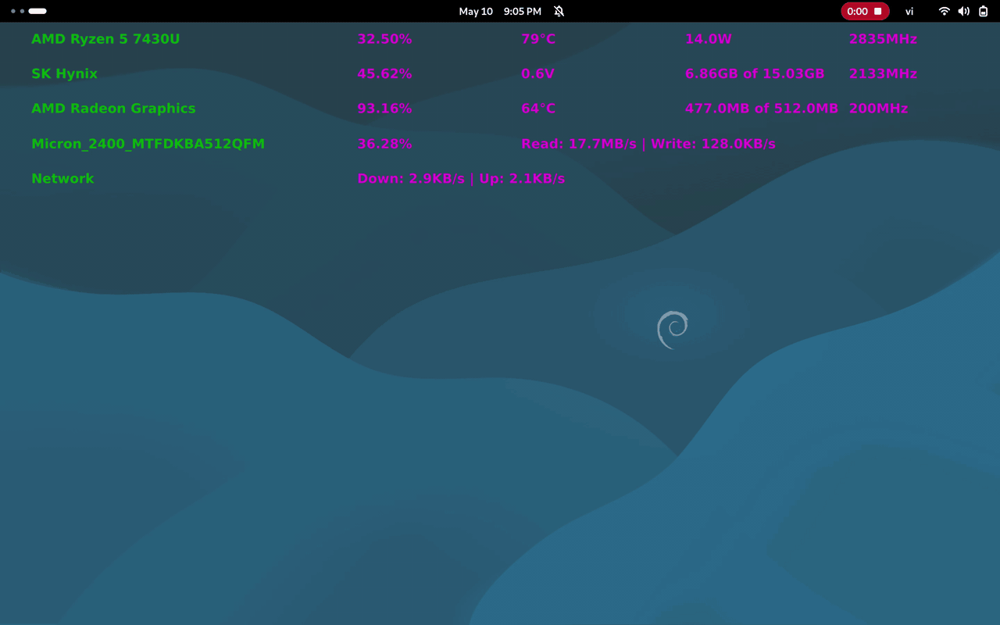

# RTSM — Real-Time System Monitor

Lightweight C++26 + Qt6 QML system monitor with an optional CLI interface. Clean Architecture: **Entity → UseCase → Adapter → Presenter → UI**.

Real-time **CPU**, **RAM**, **GPU**, **Disk**, **Network** with per-component sampling.



---

## Toolchain

| Component | Version | Path |
|---|---|---|
| GCC       | ≥ 16.2.0 | `/opt/gcc/16.2.0-native` |
| CMake     | ≥ 4.3.0 | `/opt/cmake/cmake-4.3.0` |
| Qt        | 6.11.2  | `~/Qt/6.11.2/gcc_64` |
| Generator | Ninja   | — |
| Standard  | C++26 + Modules | — |

System packages (Debian/Ubuntu):

```bash
sudo apt install -y ninja-build git wget dmidecode libx11-dev
```

> Different install paths? Edit [`CMakePresets.json`](CMakePresets.json) and [`appimage_build_ubuntu.sh`](appimage_build_ubuntu.sh).

---

## Build a Release AppImage

### Qt GUI AppImage
```bash
git clone https://gitlab.com/hp210693/rtsm.git
cd rtsm
chmod +x appimage_build_ubuntu.sh
./appimage_build_ubuntu.sh qt
```

### CLI AppImage
```bash
chmod +x appimage_build_ubuntu.sh
./appimage_build_ubuntu.sh cli
```

### Dear Imgui AppImage
```bash
chmod +x appimage_build_ubuntu.sh
./appimage_build_ubuntu.sh imgui
```

### WebAssembly (WASM) Build
```bash
chmod +x appimage_build_ubuntu.sh
./appimage_build_ubuntu.sh wasm
```

The scripts download pinned `linuxdeploy` / `appimagetool` (SHA256-verified), configure with preset `linux-gcc16-release`, build, and package.

**Supported architectures:** `x86_64` (ARM `aarch64` planned), `wasm`.

**Supported targets:** `QT` `CLI` `ImGui` `WASM`.

**Output:** `output_appimage/RTSM-<target>-<arch>-<git-tag>.AppImage` (for AppImage) or `output_appimage/` (for WebAssembly)

### Manual build

```bash
cmake --preset linux-gcc16-release        # or linux-gcc16-debug
cmake --build --preset build-release -j"$(nproc)"
```

Binaries: 
- Qt GUI: `build/linux-gcc16-release/rtsm-qt/apprtsm`
- CLI: `build/linux-gcc16-release/rtsm-cli/rtsm-cli`
- ImGui: `build/linux-gcc16-release/rtsm-imgui/rtsm-imgui`

---

## Run

**1. Install the runtime dependency** (firmware info reader):

```bash
sudo apt install -y dmidecode
```

**2. Grant passwordless `dmidecode`** so RTSM can read firmware info without prompting:

```bash
sudo sh -c 'echo "'"$USER"' ALL=(ALL) NOPASSWD: /usr/sbin/dmidecode, /usr/bin/dmidecode" > /etc/sudoers.d/dmidecode'
sudo chmod 0440 /etc/sudoers.d/dmidecode
```

> Skip this step if you ran `rtsm_install_ubuntu.sh` — it configures sudoers automatically.

**3. Launch:**

```bash
chmod +x output_appimage/RTSM-<target>-<arch>-<git-tag>.AppImage
./output_appimage/RTSM-<target>-<arch>-<git-tag>.AppImage
```

---

## Install / Uninstall (Ubuntu, Debian, GNOME)

```bash
./rtsm_install_ubuntu.sh     # installs to /opt/rtsm, adds GNOME autostart, sudoers for dmidecode
./rtsm_uninstall_ubuntu.sh   # removes everything
```

---

## Project Layout

```
rtsm-core/    Core logic (Entity, UseCase, Adapter, Presenter, Scheduler)
rtsm-qt/      Qt6 QML frontend + bindings
rtsm-cli/     Command-line interface
rtsm-imgui/   Dear ImGui frontend
```

Dependencies flow inward: **UI → Presenter → UseCase → Entity**. Adapters implement UseCase ports.

---

## Troubleshooting

- **CMake/GCC not found** — fix `PATH` and `CC`/`CXX` in [`CMakePresets.json`](CMakePresets.json).
- **Qt not found** — fix `CMAKE_PREFIX_PATH` in [`CMakePresets.json`](CMakePresets.json).
- **AppImage hash mismatch** — delete `builder_appimage/` to re-download, or update hashes in [`appimage_build_ubuntu.sh`](appimage_build_ubuntu.sh).
- **GPU/firmware info missing** — install `dmidecode` and run `rtsm_install_ubuntu.sh` for sudoers.

---

## License

MIT — see [LICENSE](LICENSE).
